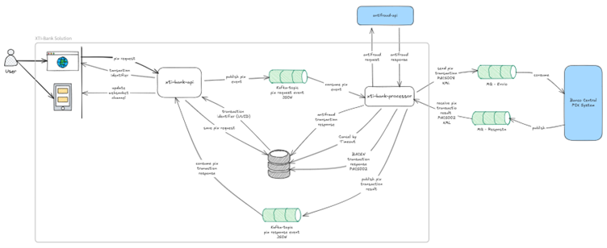
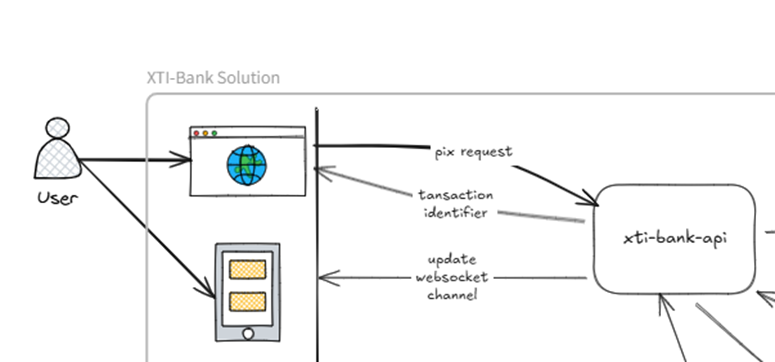
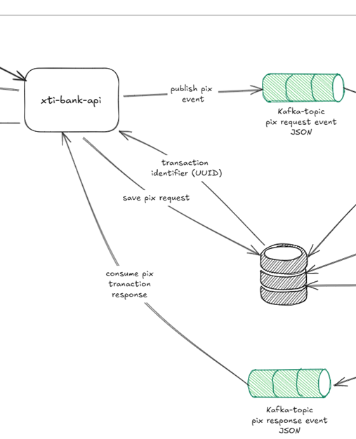
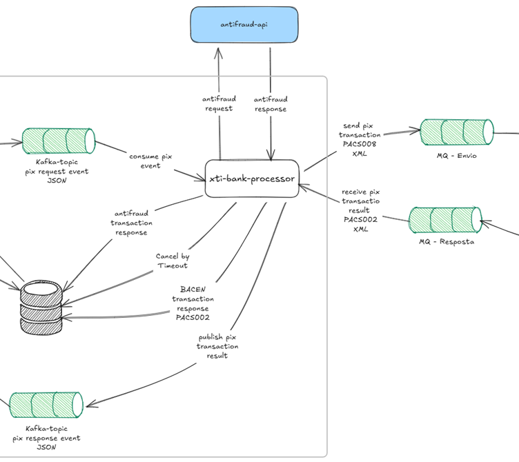

# Visao Geral da Arquitetura

## Diagrama de Arquitetura

Segue abaixo uma visão geral sobre a arquitetura da aplicação:

## Componentes

### pix-ui

- Responsável por iniciar a solicitação de uma transação PIX através da interface do utilizador;
- Estabelece e mantém um canal WebSocket com o serviço xti-bank-api para comunicação em tempo real;
- Facilita a apresentação de estados e notificações da transação ao utilizador final, garantindo uma experiência interativa.

### xti-bank-api

- Microsserviço que implementa a API REST que trata requisitos do FrontEnd e eventualmente consumidores externos;
- Cada requisição de PIX chega através de end-point REST POST;
- API valida (regras iniciais);
- Gera um código para a transação (UUID);
- Registra a mesma no banco de dados;
- Publica evento para que o processador possa continuar o processamento;
- Mantem canal WebSocket com o FrontEnd.

### xti-bank-processor

- Microsserviço que implementa o BackEnd (core) principal da solução, contém toda a regra negocial;
- Consome o evento em tópico Kafka;
- Aciona o Sistema externo de Antifraude (Simulado);
- Registra a resposta do Antifraude no banco de dados;
- Verifica timeout;
- Cria mensagem padrão PACS008;
- Publica a requisição PACS008 no MQ na fila REQUEST.Q no Bacen (Simulado);
- Consome respostas do Bacen (Simulado) no padrão PACS002;
- Registras respostas do Bacen (PACS002) no banco de dados;
- Atualiza transação (Status e StatusReason);
- Publica resposta para o originador da requisição (xti-bank-api) no Kafka tópico de resposta.

### Antifraud API

- Simulador de sistema externo para identificação de fraude;
- Disponibiliza uma API REST para ser consumida;
- Resultado indica se a transação é POSITIVA quando não foi identificado fraude ou NEGATIVO para identificar provável fraude;
- No resultado ainda existe um indicador de risco, número de 1 a 100;
- Apenas para efeito de simulação, NEGATIVO tem risco acima de 30, menos que isso indica resultado POSITIVO.

### Banco Central PIX System

- Simulador do sistema externo do Banco Central;
- Recebe requisição através de fila MQ (REQUEST.Q);
- Formato da requisição: PACS008;
- Produz resposta através de fila MQ (RESPONSE.Q);
- Formato da resposta: PACS002.

## Elementos Técnicos

### Retry

Utiliza mecanismos de Retry para as operações que visam integrações com serviços externos ou plataformas técnicas como o banco de dados (MongoDB) e plataformas de stream (MQ e Kafka).

Na corrente POC, isso foi aplicado para a integração entre o xti-bank-processor e a API Antifraude. A mesma estratégia deve ser feita com as outras integrações.

### Circuit Breaker

Utiliza mecanismo para evitar temporariamente pontos de falhas, evitando desta forma sobrecarregar elemento que se encontra com problema ou ainda tentando recuperar-se.

Pode ser pontual e técnico quando se utiliza soluções já fornecidas no framework Spring Boot (para o caso de implementação em Java), mas a ideia pode (e deve) ser aplicada a nível mais abrangente, por exemplo, se o sistema do Bacen está temporariamente fora, poderá negar automaticamente todas as requisições de PIX durante um tempo para evitar sobrecarregar o sistema que “sabidamente” está fora. Desta forma, economizando recursos computacionais.

### Elasticidade/Escalabilidade

Para aplicações modernas é recomendado a utilização de containers e funções que poderão ser administrados automaticamente em tecnologia de Nuvem para responder melhor a variação de carga, automaticamente aumentando o poder computacional (quantidade de pods/containers) para suportar o pico de carga, e também diminuindo o poder computacional para minimizar o custo da solução.

Na POC implementada, xti-bank-api e xti-bank-processor seriam implementados em container (Docker por exemplo) e toda a solução pode ser gerenciada por solução Kubernetes executando em nuvem, como por exemplo AWS EKS ou AWS ECS. Neste interagem tecnologias como Docker, Kubernetes, Helm, são normalmente utilizadas, além de outros, dependendo do provider de nuvem selecionado.

O banco de dados, aqui MongoDB poderia ser mantido em solução de Nuvem, como a MongoDB Atlas (da própria Mongo), Azure MongoDB Atlas, AWS MongoDB Atlas, AWS DocumentDB (MongoDB compatível).

### Segurança

A POC implementada não levou em consideração os diversos elementos de segurança que numa aplicação robusta e segura desta natureza precisam ser devidamente endereçados, por exemplo:

- Banco de dados em plataformas de streams implantadas em subredes privadas com controle de acesso apenas pela aplicação;
- Instancias tipo BASTION para acesso a banco de dados para evitar deixar o banco de dados com acesso público;
- dp - Identity Provider - Centralizado:
  - o	OAuth 2.1 / OpenID Connect;
  - Uso de ferramentas para centralizar gerenciamento de usuários e permissões como por exemplo KeyCloak;
  - Azure AD;
  - AWS Cognito.
- Uso de MFA – Multi Fator Authentication;
- Role Separation (dev, stage, prod);
- JWT Tokens para API (short lived);
- Uso de API Gateways:
  - Terminação TLS;
  - Limitação de Taxa (Rate limiting);
  - Throttling;
  - Filtragem de IP;
  - Interação com WAF.
- Princípio “TLS Every Where”:
  - REST API;
  - Kafka;
  - MQ Series;
  - Chamada interna dos microsserviços.
- Uso de criptografia;
- Uso de Gerenciadores de Parâmetros Criptografados:
  - AWS Secrets Manager;
  - AWS Parameter Store;
  - Azure Key Vault;
  - GCP Secrete Manager;
  - HashiCorp Vaul.
- Seguir os padrões de segurança das integrações existentes na solução, neste caso com o BACEN e com a suposta solução Antifraude.

### Observabilidade

Manter a aplicação funcionando e saudável requer constante monitoramento da mesma. Atualmente existem diversas ferramentas que permitem continuamente verificar a saúde de cada parte da aplicação, métricas como uso de CPU, uso de memória, uso de disco, trafico de rede, performance de consultas ao banco de dados, monitoramento de logs, logs centralizados, alertas, pra citar os principais. Exemplos de ferramentas são New Relic, AWS Cloud, Watch, Azure AppInsights, GrayLog, dentre outras.

### Stream Message Serialization

- Mensagens de eventos trocados entre produtores e consumidores nas plataformas de stream, como no caso do Apache Kafka devem seguir padrão de serialização bem definido, como JSON Schema ou Apache Avro, outras opções são possíveis;
- Schemas permitem versionamento das definições, o que normalmente se faz necessário para o ciclo de vida de aplicações de longa duração.

### POC Tech Stack

- Java 25;
- Spring Boot 4.x;
- Maven;
- IBM MQ Series;
- MQ Client;
- MongoDB;
- Jakarta JAXB;
- REST;
- MapStruct;
- Lombok;
- Test Container;
- JUnit;
- resilience4j-retry;
- Docker;
- Docker Composer;
- ReactJS;
- Vue.

